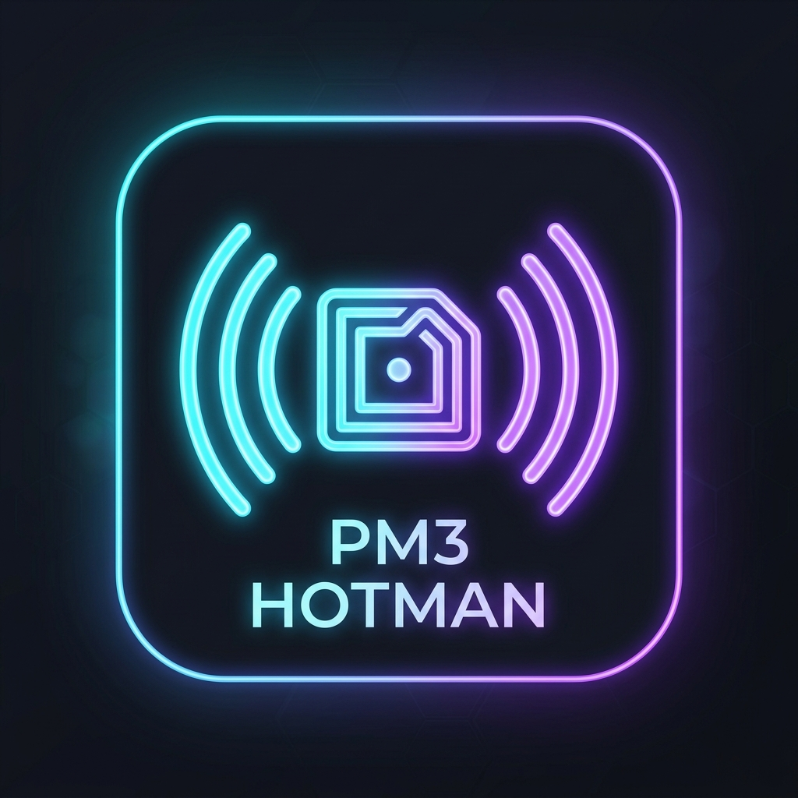
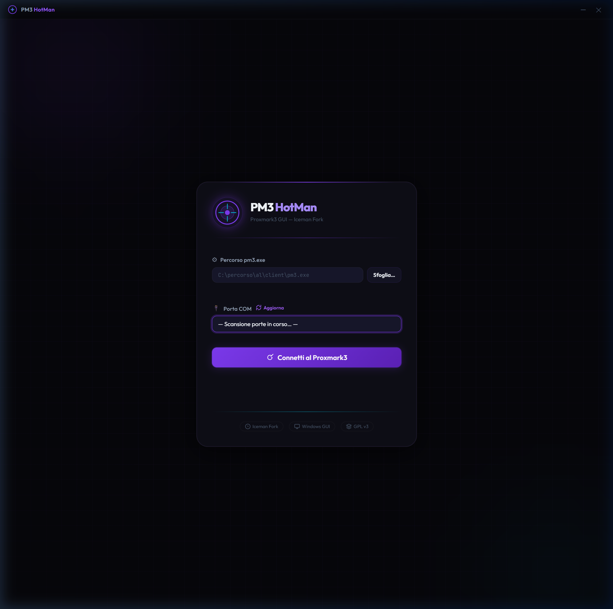

<div align="center">
  
  <h1>PM3 HotMan</h1>
  <p><strong>A Premium, Modern Desktop GUI for Proxmark3 (Iceman Fork)</strong></p>
</div>

---

**PM3 HotMan** is a next-generation Graphical User Interface for the legendary [Proxmark3](https://github.com/RfidResearchGroup/proxmark3) RFID hacking tool. Built with Electron and Node.js, it replaces the traditional command-line experience with a sleek, responsive, and powerful visual dashboard.

<div align="center">
  
</div>

## ✨ Features

- **🚀 Zero Configuration**: PM3 HotMan bundles the underlying Proxmark3 engine. Just install the setup and it will automatically detect the bundled `proxmark3.exe`.
- **🔌 Auto-Connection**: Automatically scans for available COM ports and detects your Proxmark3 hardware.
- **🗂 Structured Parsing**: Say goodbye to walls of raw text! PM3 HotMan parses the PM3 output in real-time and displays beautifully structured cards containing UIDs, keys, tag types, and dumped files.
- **📂 One-Click Dumps**: Easily locate and open your dumped binary and JSON files directly from the UI.
- **💾 Session Persistence**: Parsed results are cached per command. Switch between tasks without losing your data.
- **⚡ Quick Actions**: Built-in shortcuts for common tasks like `auto`, `hf mf info`, `lf search`, and comprehensive cracking workflows.
- **🖥 Interactive Terminal**: A global raw terminal log is always available on the side if you want to see exactly what's happening under the hood.

<div align="center">
  
</div>

## 🛠 Installation (Windows)

We provide a self-contained NSIS installer for Windows. You don't need to install MSYS2 or compile anything manually!

1. Download the latest `PM3 HotMan Setup.exe` from the Releases page.
2. Run the installer (it takes less than a minute).
3. Open **PM3 HotMan** from your Desktop shortcut.
4. Plug in your Proxmark3, select your COM port, and click **Connect**.

> **Note**: This application uses the **Iceman Fork** engine under the hood.

## 💻 Development

Want to tweak the UI or add new features? 

```bash
# Clone the repository
git clone https://github.com/RazorCopter/PM3HotMan.git
cd PM3HotMan/pm3-gui

# Install dependencies
npm install

# Run the app in development mode
npm start

# Build the Windows Installer (.exe)
npm run build
```

### Architecture
- **Renderer**: Vanilla JS + CSS (No heavy frameworks for maximum performance).
- **Main**: Electron (`main.js`), managing the PM3 PTY process, COM port scanning, and IPC bridges.
- **Parser**: A custom regex-based parsing engine (`parser.js`) that interprets the raw PM3 output and transforms it into structured UI cards.

## 📜 License

This project is open-source and follows the GPL-3.0 License (same as the underlying Proxmark3 project). See `LICENSE.txt` for details.

## 🙏 Acknowledgements

- Built for the amazing [Iceman Fork](https://github.com/RfidResearchGroup/proxmark3) of Proxmark3.
- Thanks to the RFID research community.
