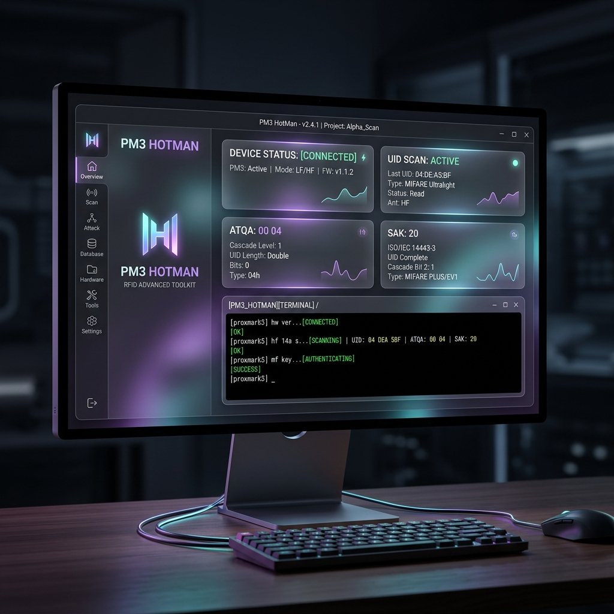

<div align="center">
  
</div>

<div align="center">
  
  <h1>🔥 PM3 HotMan</h1>
  <p><strong>The Premium, Modern Desktop GUI for Proxmark3 (Iceman Fork)</strong></p>
  
  [](https://github.com/RazorCopter/PM3HotMan/releases)
  [](https://www.gnu.org/licenses/gpl-3.0)
  [](https://github.com/RazorCopter/PM3HotMan/releases)
</div>

<br/>

**PM3 HotMan** is a next-generation Graphical User Interface for the legendary [Proxmark3](https://github.com/RfidResearchGroup/proxmark3) RFID hacking tool. Built with Electron and Node.js, it replaces the traditional command-line experience with a stunning, responsive, and powerful visual dashboard.

<div align="center">
  
</div>

---

## ✨ Premium Features

- **🚀 Zero Configuration (Windows)**: PM3 HotMan bundles the underlying Proxmark3 engine for Windows. Just install the setup and it will automatically detect the bundled client.
- **🐧 Native Linux Support**: Runs natively on Linux via Electron with native serial port scanning and support for your local Proxmark3 installation.
- **💎 Cyberpunk UI & Glassmorphism**: A dark-mode, neon-accented interface designed for hackers who care about aesthetics as much as performance.
- **🔌 Auto-Connection & Smart Device Detection**: Automatically scans for available COM/tty ports and visually highlights your genuine Proxmark3 hardware (`9AC4:4B8F`).
- **🗂 Structured Parsing**: Say goodbye to walls of raw text! PM3 HotMan parses the PM3 output in real-time and displays beautifully structured cards containing UIDs, keys, tag types, and dumped files.
- **📂 One-Click Dumps**: Easily locate and open your dumped binary and JSON files directly from the UI. Dumps are safely stored in your `Documents` folder.
- **💾 Session Persistence**: Parsed results are cached per command. Switch between tasks without losing your data.
- **⚡ Quick Actions**: Built-in shortcuts for common tasks like `auto`, `hf mf info`, `lf search`, and comprehensive cracking workflows.
- **⏹ Safe Command Stop**: Interrupt long-running brute-force or cracking commands directly from the output panel or raw terminal.
- **🔄 Firmware & Client Updater**: Checks the connected device against the latest RRG release, selects the correct Generic/RDV4 build, validates the Windows package, flashes bootloader and full image, then atomically activates the matching client.
- **🌐 Bilingual Interface (ITA / ENG)**: Seamless instant switching between Italian and English with localized command cards, parameters, descriptions, and system logs.
- **🖥 Interactive Terminal**: A global raw terminal log is always available on the side if you want to see exactly what's happening under the hood.

---

## 🛠 Installation (Windows)

We provide a self-contained NSIS installer for Windows. You don't need to install MSYS2 or compile anything manually!

1. Download the latest `PM3 HotMan Setup.exe` from the [Releases page](https://github.com/RazorCopter/PM3HotMan/releases).
2. Run the installer (it takes less than a minute).
3. Open **PM3 HotMan** from your Desktop shortcut.
4. Plug in your Proxmark3, select your COM port, and click **Connect**.

> **Note**: This application uses the **Iceman Fork** engine under the hood.

---

## 🐧 Native Linux Support & Setup

PM3 HotMan runs natively on Linux (Ubuntu, Debian, Kali, Arch, Fedora, etc.) thanks to its modern Electron core.

### 1. Prerequisites & Serial Permissions

#### A. Install Node.js (v18+)
```bash
# Ubuntu / Debian / Kali:
sudo apt update && sudo apt install -y nodejs npm
```

#### B. Grant Serial Port Permissions
Linux restricts access to serial communication devices (`/dev/ttyACM*`) by default:
```bash
# Ubuntu / Debian / Kali / Linux Mint:
sudo usermod -aG dialout $USER

# Arch Linux / Manjaro / Fedora:
sudo usermod -aG uucp $USER
```
> ⚠️ **Important**: Log out and log back in (or reboot) for group changes to take effect.

#### C. Prevent ModemManager Conflicts & Setup udev Rules
`ModemManager` may attempt to send AT commands to your Proxmark3 when plugged in, locking the port. Install the official udev rules:
```bash
sudo cp /path/to/proxmark3/driver/77-pm3-usb-device.rules /etc/udev/rules.d/
sudo udevadm control --reload-rules
sudo udevadm trigger
```

### 2. Native Proxmark3 Client
On Linux, HotMan interfaces with your native Linux `proxmark3` binary (ELF executable), typically located at:
- `/usr/local/bin/proxmark3`
- `/usr/bin/proxmark3`
- Or compiled in your local git checkout: `~/proxmark3/client/proxmark3`

If you haven't compiled the client yet, follow the standard Iceman compilation steps:
```bash
git clone https://github.com/RfidResearchGroup/proxmark3.git
cd proxmark3
make clean && make client
sudo make install
```

### 3. Launching PM3 HotMan on Linux

```bash
# Clone and enter the repository
git clone https://github.com/RazorCopter/PM3HotMan.git
cd PM3HotMan/pm3-gui

# Install dependencies and start
npm install
npm start
```

You can also build standalone Linux packages (`AppImage` and `.deb`):
```bash
npm run build:linux
```

### 4. Connection Screen Setup on Linux

1. **Proxmark3 Client Path**: Enter the path to your native Linux binary (e.g. `/usr/local/bin/proxmark3`).
   > ⛔ **Do not select `proxmark3.exe` on Linux**: `.exe` files are Windows PE binaries and cannot be executed natively.
2. **Serial Port**: Choose the device labeled with `PROXMARK3` (usually `/dev/ttyACM0` with ID `9AC4:4B8F`).
   > ⚠️ **Avoid LTE/WWAN modems**: Laptop cellular modems (such as Fibocom, Quectel, Sierra Wireless) often register as `/dev/ttyACM1`. Selecting a modem will result in a connection failure (`Exit code 2`).
3. Click **Connect to Proxmark3**.

---

### ❓ Troubleshooting: "proxmark3 exited with code 2"

If you encounter `Errore: proxmark3 uscito con codice 2` (Exit code 2) when connecting:
1. **Check the port**: Make sure `/dev/ttyACM0` (`proxmark.org` / `9AC4:4B8F`) is selected, and NOT `/dev/ttyACM1` (e.g. `FIBOCOM` LTE modem).
2. **Check the executable**: Verify that you are pointing to the native Linux executable (`proxmark3`) and not a Windows file (`proxmark3.exe`). Test it in terminal: `/usr/local/bin/proxmark3 -p /dev/ttyACM0 -c 'hw version'`.
3. **Check permissions**: Run `groups` in terminal. Ensure `dialout` (or `uucp`) is listed.
4. **Check ModemManager**: Run `sudo systemctl stop ModemManager` temporarily to see if it was holding the serial lock.

---

---

## 💻 Development & Building

Want to tweak the UI, customize the parser, or add new features? 

```bash
# 1. Clone the repository
git clone https://github.com/RazorCopter/PM3HotMan.git
cd PM3HotMan/pm3-gui

# 2. Install dependencies
npm install

# 3. Run the app in development mode
npm start

# 4. Build the Windows Installer (.exe)
npm run build
```

### Architecture Overview
- **Renderer**: Vanilla JS + CSS (No heavy frameworks for maximum performance).
- **Main**: Electron (`main.js`), managing the PM3 PTY process, COM port scanning, and IPC bridges securely.
- **Parser**: A custom regex-based parsing engine (`parser.js`) that interprets the raw PM3 output and transforms it into structured UI cards.

---

## 📜 License

This project is open-source and follows the [GPL-3.0 License](LICENSE.txt) (same as the underlying Proxmark3 project).

## 🙏 Acknowledgements

- Built for the amazing [Iceman Fork](https://github.com/RfidResearchGroup/proxmark3) of Proxmark3.
- Thanks to the RFID research community.
